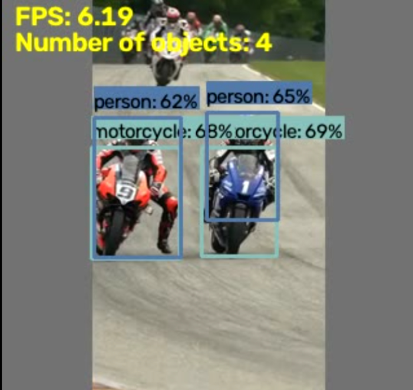
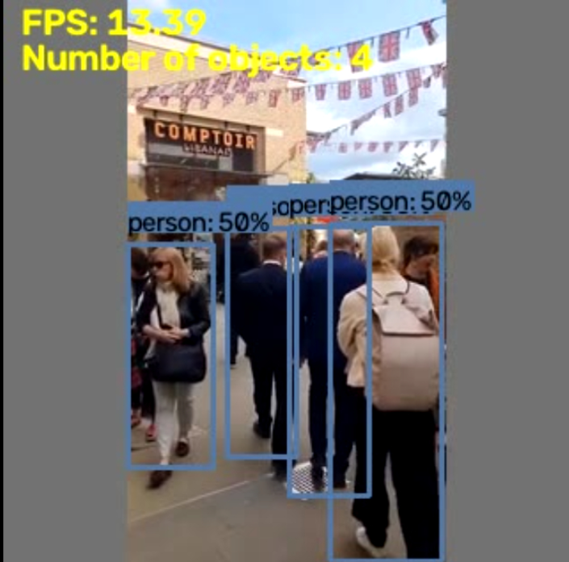

# YOLO Object Detection on Raspberry Pi 4

Run YOLOv8n, YOLO11n, and YOLO26n object detection on a Raspberry Pi 4 (4GB) 
using **NCNN (FP32)** and **TFLite (INT8)**. Includes real FPS benchmarks, 
confidence comparisons, and ready-to-use inference scripts.

> **Core finding:** On RPi 4, TFLite INT8 delivers ~2× the FPS of NCNN FP32, 
> but at ~40% lower confidence. Choose based on your use case.

---

## Results at a Glance

| Model   | Format      | FPS   | Confidence   | Model Size | Best For          |
|---      |---          |---    |---           |---         |---                |
| YOLO26n | NCNN FP32   | 6.46  | 0.80+        | ~9 MB      | Accuracy-critical |
| YOLO26n | TFLite INT8 | 13.75 | 0.50         | ~3 MB      | Real-time         |

**Test conditions:**
- Input resolution: **320×320** (model input, source video, and display — all matched)
- Raspberry Pi 4 Model B, 4GB RAM
- Aluminum active cooler, max temp **55°C**
- CPU utilization: **80–90%**
- Memory usage: **<300 MB**

---

## Sample Detections

| NCNN FP32                                  | TFLite INT8                                       |
|---                                         |---                                                |
|         |                |
| Fewer missed detections, higher confidence | ~2× faster, some missed detections on fast motion |

📹 **Demo videos** (cars, motorbike race, walking people): 
[Google Drive Link_INT8](https://drive.google.com/file/d/18btB0biU3lcJkqI_Vh6oD5Ij3VpBgjqZ/view?usp=sharing) 

[Google Drive Link_NCNN](https://drive.google.com/file/d/1FOhmlRMAhpWQhI1zJy8j5thJRhkukrr3/view?usp=sharing)

---

## Why This Repo

The Raspberry Pi 4 is not an AI accelerator board. It has no NPU, no GPU compute 
for ML, and a modest quad-core ARM CPU. Yet it **can** run YOLO object detection 
in real time — if you choose the right model format and input resolution.

This repo documents:
- What actually works on RPi 4 and what doesn't
- Real FPS and confidence numbers for NCNN vs TFLite INT8
- The accuracy/speed tradeoff between the two approaches
- Complete setup, export, and inference scripts

---

## Hardware Used

| Component | Spec                                     |
|---        |---                                       |
| Board     | Raspberry Pi 4 Model B (4GB RAM)         |
| Cooling   | Aluminum active cooler                   |
| Camera    | Raspberry Pi Camera Module v1.3 (OV5647) |
| Storage   | 64GB USB 3.0 boot drive                  |
| OS        | Raspberry Pi OS (64-bit, Debian Trixie)  |
| Python    | 3.13                                     |

---

## Software Stack

| Layer               | Tool                                       |
|---                  |---                                         |
| Model training      | Ultralytics YOLO (in Google Colab, T4 GPU) |
| Export format 1     | NCNN (FP32)                                |
| Export format 2     | TFLite (INT8 quantized)                    |
| Inference runtime 1 | ncnn-python                                |
| Inference runtime 2 | ai-edge-litert (LiteRT)                    |
| Computer vision     | OpenCV                                     |
| Camera              | picamera2                                  |

---

## Quick Start

Follow these guides in order:

1. **[Environment Setup](docs/01_environment_setup.md)** — Create the venv, install packages
2. **[Model Export](docs/02_model_export.md)** — Export YOLO to NCNN and TFLite INT8 in Colab
3. **[NCNN Inference](docs/03_ncnn_inference.md)** — Run NCNN FP32 model on RPi 4
4. **[TFLite INT8 Inference](docs/04_tflite_int8_inference.md)** — Run INT8 model on RPi 4
5. **[Full Results & Analysis](docs/05_results_comparison.md)** — Detailed benchmark data

---

## Repository Structure

rpi4-yolo-object-detection/
├── README.md
├── LICENSE
├── .gitignore
├── docs/
│ ├── 01_environment_setup.md
│ ├── 02_model_export.md
│ ├── 03_ncnn_inference.md
│ ├── 04_tflite_int8_inference.md
│ └── 05_results_comparison.md
├── scripts/
│ ├── yolo_detect_ncnn.py
│ ├── yolo_detect_tflite.py
│ └── resize_video.sh
├── samples/
│ ├── ncnn_detection.png
│ └── int8_detection.png
└── models/
└── README.md

---

## When to Use Which

### Use NCNN FP32 when:
- Accuracy is more important than speed
- Objects are fast-moving and you can't afford missed detections
- You can accept ~6 FPS (still usable for slow scenes)

### Use TFLite INT8 when:
- Real-time performance matters most
- Objects are relatively slow-moving or static
- You need to run other processes alongside inference
- ~14 FPS changes the user experience

---

## Key Observations

- **Source video resolution does not affect FPS** — the model input is always 
  resized to 320×320, so feeding 720p or 320p gives the same inference speed.
- **INT8 quantization trade-off** — 2× FPS but roughly 40% lower confidence. 
  Fast-moving objects are missed more often.
- **CPU is the bottleneck** — 80–90% utilization means no headroom for 
  additional processing (tracking, OCR, multi-stream).
- **Thermal headroom is fine** — 55°C max with active cooling; no throttling.
- **Memory is not the constraint** — using <300 MB of 4 GB available.

---

## Full Analysis

See [docs/05_results_comparison.md](docs/05_results_comparison.md) for:
- Per-model FPS and confidence measurements
- Confusion patterns in missed detections
- Reasoning behind the accuracy/speed tradeoff
- Recommendations for edge AI on RPi 4

---

## Roadmap

Tested and confirmed:
- ✅ YOLO26n — NCNN FP32
- ✅ YOLO26n — TFLite INT8

The same pipeline applies to:
- YOLO11n
- YOLOv8n

Bring your own model, follow the docs, and share your numbers.

---

## Author

**Santhosh Kamatchi P** — [@SanthoshKamatchiP](https://github.com/SanthoshKamatchiP)

## License

MIT License — free to use, modify, and distribute. See [LICENSE](LICENSE).

---

## Credits

- [Ultralytics YOLO](https://github.com/ultralytics/ultralytics) — model training and export
- [Tencent NCNN](https://github.com/Tencent/ncnn) — NCNN framework
- [Google LiteRT](https://ai.google.dev/edge/litert) — TFLite runtime (`ai-edge-litert`)
- [Raspberry Pi Foundation](https://www.raspberrypi.com/) — hardware and OS
